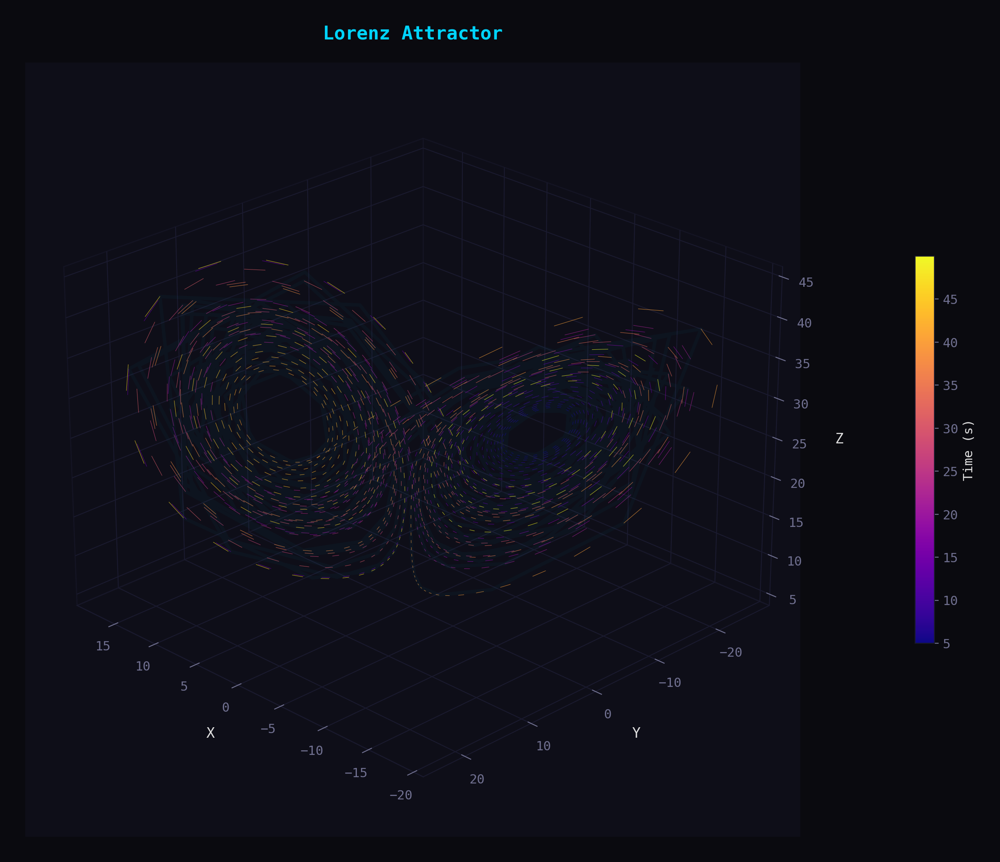
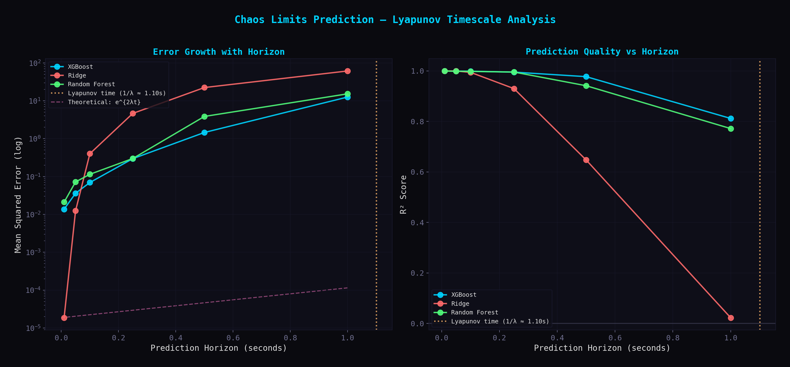
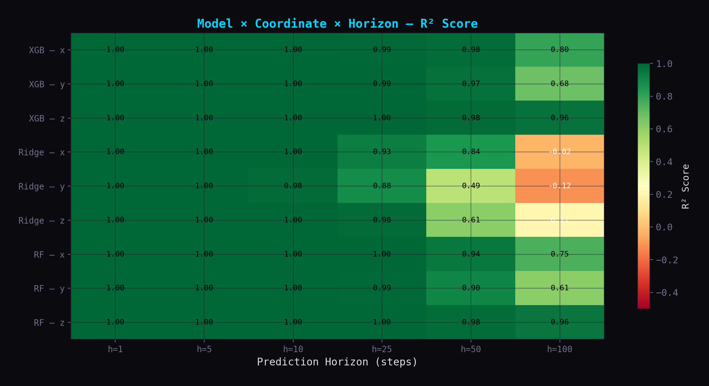
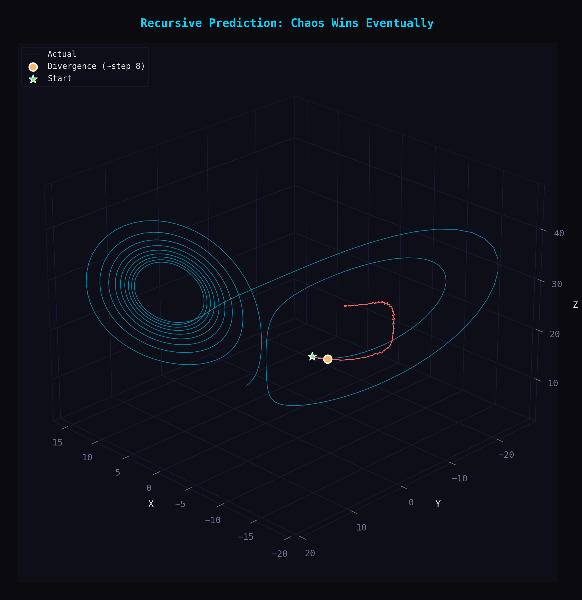
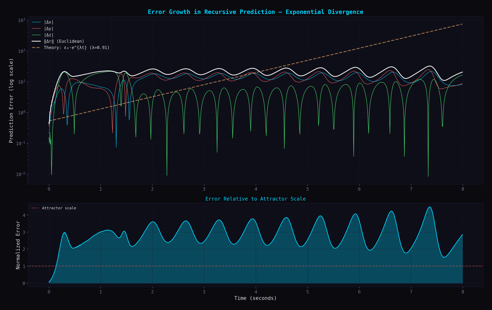
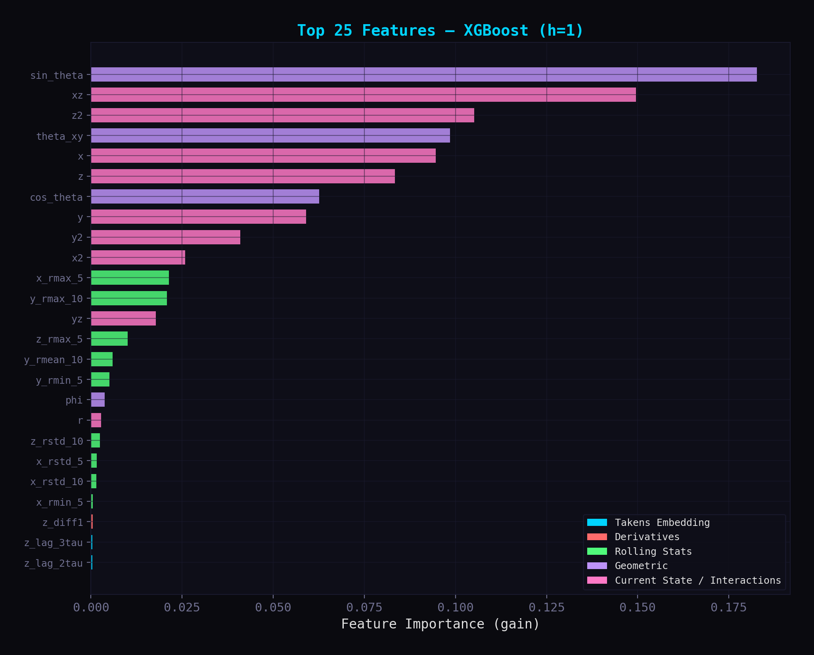
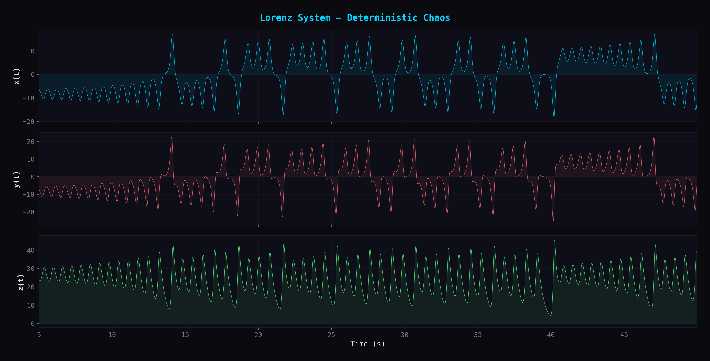
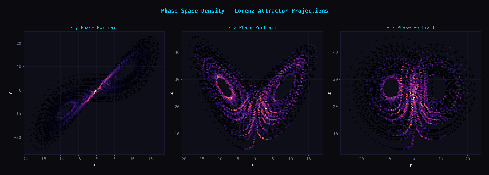
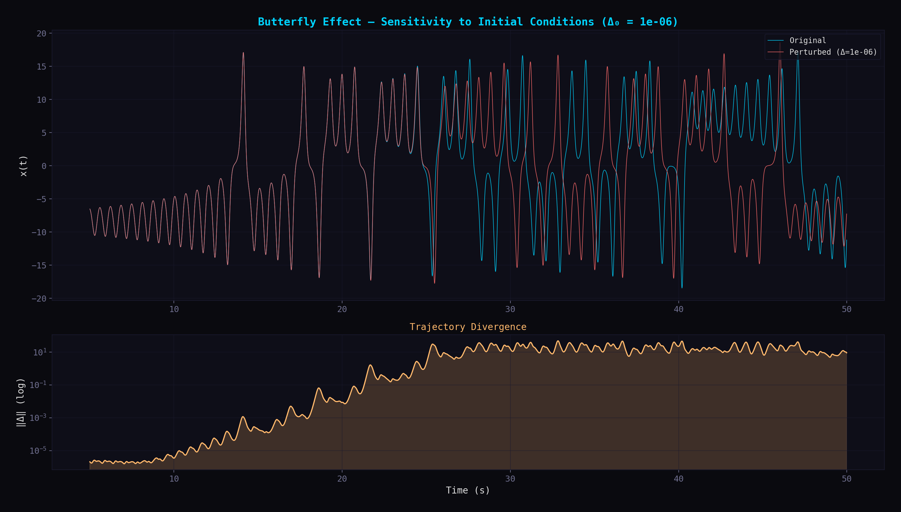
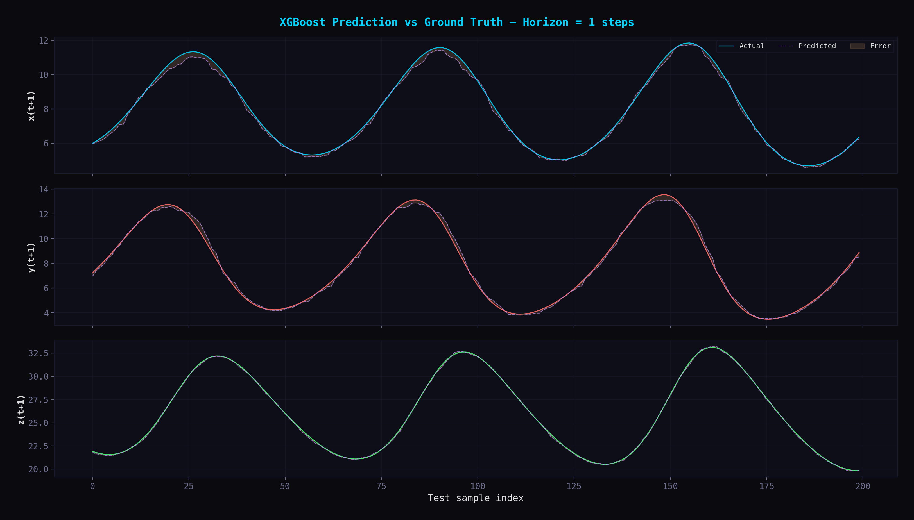

# Predicting Chaos: Machine Learning on the Lorenz Attractor

> Can gradient-boosted trees learn the structure of a strange attractor — and where does chaos make prediction impossible?

This project trains XGBoost, Random Forest, and Ridge Regression to predict future states of the **Lorenz system** — the canonical example of deterministic chaos. The core result: prediction error grows exponentially at exactly the rate predicted by the system's **maximal Lyapunov exponent**, providing a clean empirical verification of a fundamental result in nonlinear dynamics using classical ML.

<p align="center">
  
</p>

---

## Motivation

Most ML portfolios showcase standard supervised learning on tabular data. This project asks a deeper question: **what are the theoretical limits of prediction for deterministic systems?** The Lorenz attractor is fully deterministic — no randomness anywhere — yet long-term prediction is provably impossible due to sensitive dependence on initial conditions (the "butterfly effect"). This creates a natural experiment:

- At **short horizons**, XGBoost achieves R² = 0.9998 — nearly perfect prediction.
- At **long horizons**, R² degrades to 0.81 — and the rate of degradation matches the Lyapunov exponent.
- The **Lyapunov timescale** (1/λ ≈ 1.10s) acts as a hard wall that no model — no matter how complex — can push past.

This isn't just a modeling exercise. It demonstrates understanding of **why** models fail, not just **how** to build them.

---

## Key Results

### Prediction quality degrades at the Lyapunov timescale

| Horizon (steps) | Horizon (seconds) | MSE | MAE | R² |
|:---:|:---:|:---:|:---:|:---:|
| 1 | 0.01s | 0.0137 | 0.0781 | **0.9998** |
| 5 | 0.05s | 0.0361 | 0.1178 | 0.9995 |
| 10 | 0.10s | 0.0695 | 0.1636 | 0.9990 |
| 25 | 0.25s | 0.2969 | 0.3049 | 0.9954 |
| 50 | 0.50s | 1.4584 | 0.7168 | 0.9775 |
| 100 | 1.00s | 12.5830 | 1.6518 | **0.8120** |

**Estimated maximal Lyapunov exponent:** λ = 0.91 → **Prediction horizon limit ≈ 1.10 seconds**

<p align="center">
  
</p>

### XGBoost dominates at longer horizons

The model comparison heatmap reveals that XGBoost maintains R² > 0.68 on all coordinates at h=100, while Ridge Regression collapses to negative R² — its linear assumptions break down as the prediction horizon extends into the chaotic regime.

<p align="center">
  
</p>

### Recursive prediction diverges exponentially

When we feed predictions back as inputs (autoregressive forecasting), the model tracks the true trajectory for roughly 0.3 seconds before chaos wins. The error growth rate matches the theoretical e^{λt} envelope.

<p align="center">
  
  
</p>

### Feature importance reveals physics

The top features are `sin_theta` (which lobe of the attractor the system is on), `xz` and `z²` (terms that appear directly in the Lorenz equations), and the geometric angle `theta_xy`. XGBoost is effectively learning an approximation of the ODE dynamics.

<p align="center">
  
</p>

---

## System Dynamics Visualizations

<p align="center">
  
</p>

<p align="center">
  
</p>

### Butterfly Effect

Two trajectories starting 10⁻⁶ apart diverge completely within ~20 seconds — a textbook demonstration of sensitive dependence on initial conditions.

<p align="center">
  
</p>

### One-step prediction accuracy

At horizon h=1, XGBoost predictions (dashed) are nearly indistinguishable from ground truth (solid).

<p align="center">
  
</p>

---

## Project Structure

```
chaos_prediction/
├── main.py                  # Pipeline orchestrator (run this)
├── requirements.txt         # Python dependencies
├── src/
│   ├── __init__.py
│   ├── config.py            # All hyperparameters and paths (frozen dataclasses)
│   ├── simulate.py          # Lorenz ODE integration + Lyapunov estimation
│   ├── features.py          # Takens embedding, rolling stats, interactions
│   ├── train.py             # XGBoost/Ridge/RF training, multi-horizon eval
│   └── visualize.py         # 10 publication-quality dark-theme figures
├── figures/                 # Generated plots (10 PNGs)
├── models/                  # Serialized XGBoost models (joblib)
└── data/                    # Raw trajectory (npz)
```

---

## Technical Approach

### Data Generation
The Lorenz system is integrated using SciPy's `solve_ivp` with RK45 (adaptive Runge-Kutta) at `rtol=1e-10`, `atol=1e-12` — well beyond the accuracy needed. Initial transients (500 steps) are discarded to ensure the trajectory is on the attractor.

### Feature Engineering (96 features)
All features are strictly backward-looking to prevent temporal leakage:

- **Current state** (3): raw x, y, z coordinates
- **Takens delay embedding** (27): motivated by the embedding theorem — for attractor dimension d, embedding dimension ≥ 2d+1 guarantees a diffeomorphic reconstruction of the attractor
- **Finite differences** (6): 1st and 2nd order numerical derivatives (velocity, acceleration)
- **Rolling statistics** (48): mean, std, min, max over windows [5, 10, 25, 50]
- **Cross-variable interactions** (7): xy, xz, yz, x², y², z², r — motivated by the terms that appear in the Lorenz ODE
- **Geometric features** (5): angular position (which lobe), distance from z-axis, elevation

### Training Protocol
- **Temporal split**: 60/20/20 train/val/test — strictly chronological, no shuffling
- **Early stopping**: XGBoost uses validation set with 30-round patience
- **Multi-horizon evaluation**: models are trained independently for each prediction horizon h ∈ {1, 5, 10, 25, 50, 100}
- **Baselines**: Ridge Regression (linear) and Random Forest (ensemble) for comparison

### Lyapunov Exponent Estimation
The maximal Lyapunov exponent is computed via the standard trajectory divergence algorithm: evolve two nearby trajectories, periodically renormalize the perturbation vector, and average the logarithmic growth rate over 20,000 iterations.

---

## Quick Start

### Requirements
- Python 3.9+
- ~8 GB RAM
- Runs on CPU (tested on Apple M3 Air — full pipeline in ~90 seconds)

### Installation

```bash
git clone https://github.com/rafaelespinosamena/chaos-prediction.git
cd chaos-prediction
pip install -r requirements.txt
```

### Run

```bash
# Full pipeline (all 6 horizons, ~90s on M3)
python main.py

# Quick test (3 horizons, ~30s)
python main.py --quick
```

This generates all 10 figures in `figures/`, serialized models in `models/`, and prints a results summary to the console.

---

## Key Takeaways

1. **Classical ML can learn chaotic dynamics** — XGBoost achieves near-perfect short-term prediction (R² > 0.999) by implicitly learning an approximation of the ODE.

2. **Chaos imposes a hard prediction limit** — no amount of model complexity can push prediction quality past the Lyapunov timescale (~1.1s for standard Lorenz parameters).

3. **Feature engineering matters more than model choice** — the physics-informed features (Takens embedding, ODE-motivated interactions, geometric angle) dominate feature importance, and all three models benefit from them roughly equally at short horizons.

4. **Tree-based models degrade gracefully** — XGBoost maintains R² = 0.81 at h=100, while Ridge collapses to R² ≈ 0.03. The nonlinear decision boundaries handle the attractor's geometry better than linear projections.

5. **Recursive prediction amplifies errors exponentially** — even a model with R² = 0.9998 at one step produces trajectories that diverge from truth within ~30 recursive steps, matching the theoretical e^{λt} error growth.

---

## References

- Lorenz, E.N. (1963). "Deterministic Nonperiodic Flow." *Journal of the Atmospheric Sciences*, 20(2), 130–141.
- Takens, F. (1981). "Detecting Strange Attractors in Turbulence." *Lecture Notes in Mathematics*, 898, 366–381.
- Kantz, H. & Schreiber, T. (2004). *Nonlinear Time Series Analysis.* Cambridge University Press.

---

## License

MIT License — see [LICENSE](LICENSE) for details.
